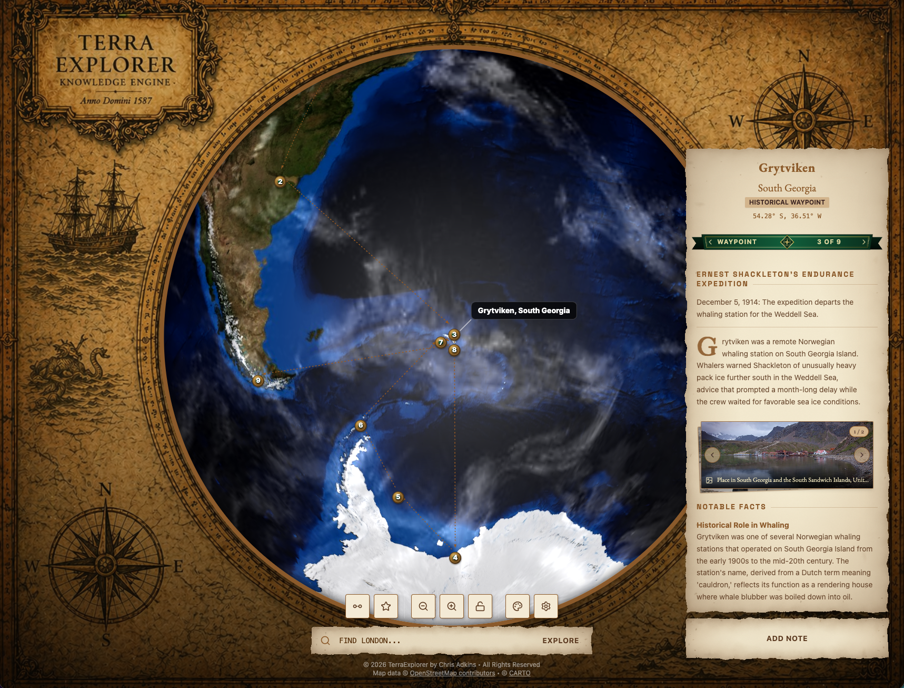
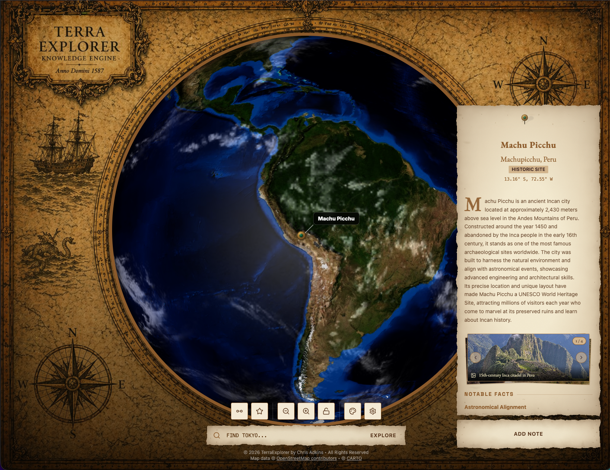
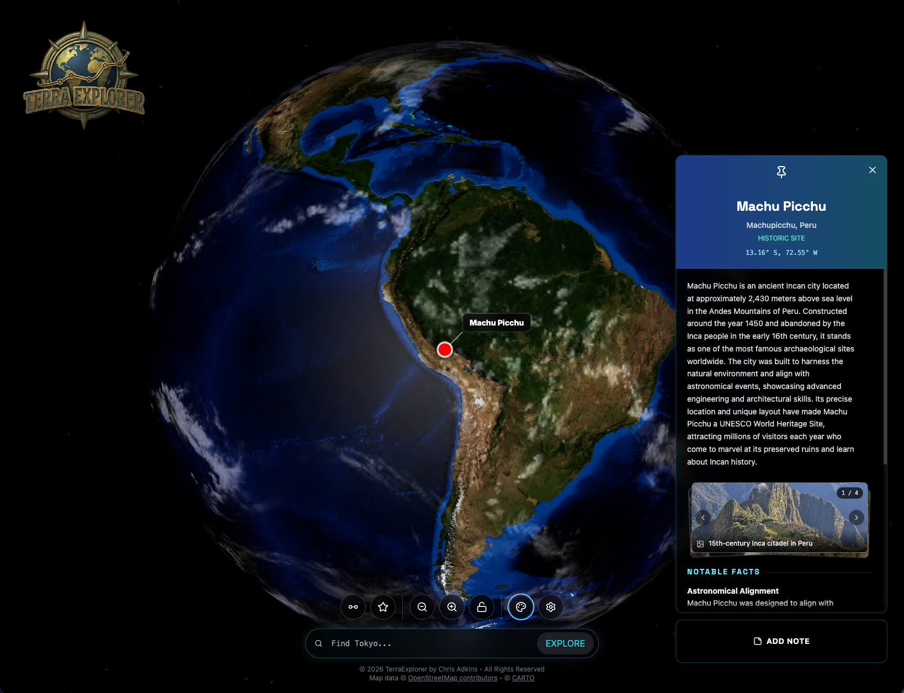
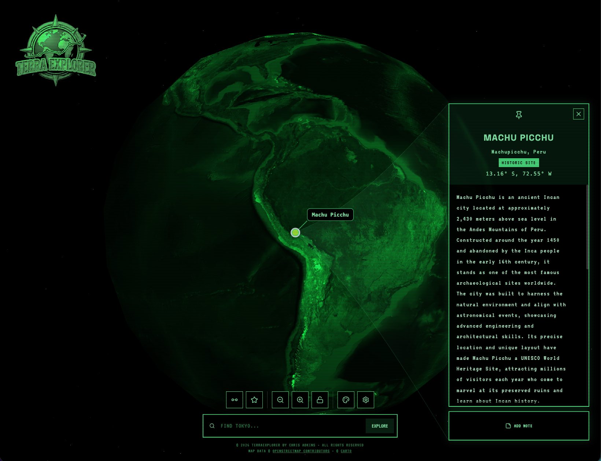
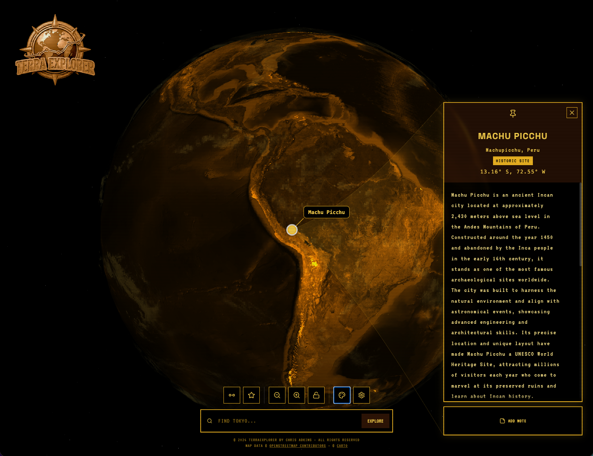

  

# TerraExplorer

TerraExplorer is an interactive 3D globe application that lets users freely navigate the planet or quickly jump to cities, states, landmarks, and unique points of interest through a powerful search experience. It supports rich data layers including shipwrecks, natural wonders, and historical sites, provides overlays with location overviews, current news, and notable people associated with each place, and includes the Trace Route feature that extracts locations from any article, URL, or text block to build a connected journey across them.

  
  
  
  

## Features

* Interactive 3D Globe: Seamlessly rotate, zoom, and explore a high-fidelity 3D model of the Earth.
* OpenStreetMap Street Data: Zoom from the 3D globe into detailed street-level map data using CARTO vector maps based on OpenStreetMap data. CARTO vector maps require a CARTO API key to access the map services. OpenStreetMap attribution requirements are preserved and displayed within the application.
* AI-Powered Insights: Click anywhere or search for a location to receive AI-generated encyclopedic summaries, population data, climate information, notable facts, and other location information. Supports both Google Gemini and local AI inference through LM Studio.
* Documentary Mode: Automatically guides the camera through a cinematic descent from the 3D globe to the selected location. The camera maintains the selected geographic orientation while transitioning from the globe into the street-level map view, creating a continuous cinematic journey into the destination.
* Location Narration: Narrates the selected location’s title and description using the browser’s built-in speech synthesis capabilities. Narration integrates with Documentary Mode to provide an audio introduction while the camera transitions toward the selected location.
* Real-Time News: Fetches current news headlines relevant to the selected location using configurable news providers and API keys.
* Visual Themes (Skins):
    * Parchment: Antique cartographic theme with a parchment-textured backdrop. The globe remains the focal point, framed by vintage nautical illustrations.
    * Modern: Sleek glassmorphism UI with high-resolution textures.
    * CRT Green: Retro monochrome green monitor effect with scanlines and pixelated typography.
    * CRT Amber: Amber monochrome variation for a different retro feel.
* Favorites System: Bookmark interesting locations to revisit them later.
* Personal Notes: Add and save personal notes for specific locations, persisted locally.
* Smart Search: Use natural-language search to resolve questions and location references to specific geographic coordinates.
* Trace Route: Paste an article, URL, or text block and the system identifies referenced locations and generates a connected journey across them.

Map Configuration & Attribution

TerraExplorer uses CARTO vector maps for its street-level OpenStreetMap experience. The maps are based on OpenStreetMap data and are rendered through CARTO’s vector map services.

A CARTO API key is required for access to the vector map services. Configure your API key in .env:

VITE_CARTO_API_KEY=your_carto_api_key

OpenStreetMap and CARTO attribution requirements remain in effect and are presented within the application.

Local Orpheus TTS

TerraExplorer supports local neural speech narration using Orpheus TTS in addition to the browser's built-in System Voice. Running Orpheus requires a separate local service and LM Studio.

For complete installation, LM Studio, bridge, voice, and troubleshooting instructions, see [local-services/orpheus-tts/README.md](local-services/orpheus-tts/README.md).

Setup

Environment Variables

Copy .env.example to .env and configure your API keys:

### Required for AI-powered location insights and smart search
GEMINI_API_KEY=your_gemini_api_key
### Required for CARTO vector and raster map services
VITE_CARTO_API_KEY=your_carto_api_key
### Optional news providers for real-time location news
VITE_NYT_API_KEY=your_nytimes_api_key
VITE_NEWS_API_KEY=your_newsapi_org_key
VITE_NEWS_DATA_API_KEY=your_newsdata_io_key

(AI provider settings, local LM Studio endpoints, and news provider keys can also be configured directly within the in-app Settings panel).

Installation & Running

### Install dependencies
npm install
### Start the development server
npm run dev
### Build for production
npm run build

Usage

1. Explore the Globe: Drag to rotate the 3D Earth model. Scroll to zoom from planetary orbit down to street-level CARTO/OpenStreetMap vector detail.
2. Search & Discover: Use the natural-language search bar to find destinations or click directly on landmasses, cities, and points of interest.
3. Location Overview: Open the InfoPanel to view AI-generated encyclopedic summaries, population figures, climate statistics, notable facts, and live news.
4. Documentary Mode: Enable Documentary Mode in Settings or the HUD to experience cinematic camera descent from the globe into the street-level view, maintaining geographic orientation into the destination.
5. Location Narration: Enable speech synthesis narration to listen to spoken introductions and descriptive summaries of selected locations.
6. Trace Route: Open Trace Route and paste any article, URL, or itinerary text block to automatically extract referenced locations and plot a connected journey across the globe.
7. Visual Themes: Toggle between visual skins (Parchment, Modern, CRT Green, CRT Amber) to change the cartographic aesthetic.

Key Components

* Earth.tsx: Renders the 3D globe model, orbital interaction controls, atmosphere shaders, lighting, and marker overlays.
* OSMMapLayer.tsx: Slippy-map overlay rendering CARTO vector maps and raster fallbacks using MapLibre GL, with theme-specific CRT phosphor shaders.
* InfoPanel.tsx: UI overlay displaying encyclopedic location overviews, climate statistics, notable people, personal notes, and live news.
* Controls.tsx: Main HUD for natural-language search, Trace Route journey plotting, zoom navigation, skin switching, and settings.
* SettingsPanel.tsx: Modal for configuring AI backends (Google Gemini / LM Studio), news providers, narration, and Documentary Mode preferences.
* documentaryController.ts: Orchestrates cinematic camera descents, atmosphere fog transitions, waypoint-to-waypoint framing, and narration synchronization.
* narrationService.ts: Native browser Web Speech API synthesis service for spoken location titles and descriptions.
* geminiService.ts: Google GenAI SDK integration for structured location intelligence, entity validation, and query classification.
* osmTileService.ts: Manages CARTO vector style fetching, theme transformations, tile coordinate mathematics, and geometry creation.
* routeExtractionService.ts: Natural-language text analysis and geographic resolution for the Trace Route journey pipeline.

AI Development Context

Before making architectural changes, review:

docs/AI_CONTEXT.md

This file contains project architecture, conventions, data models, debugging history, and design decisions.