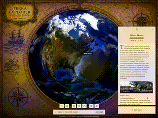

<p align="center" style="background-color:black; padding:20px;">
  
  <a href="assets/parchment-zoom.gif">
    
  </a>
</p>

## TerraExplorer

Terra Explorer is an interactive 3D globe application that lets users freely navigate the planet or quickly jump to cities, states, landmarks, and unique points of interest through a powerful search experience. It supports rich data layers including shipwrecks, natural wonders, and historical sites, provides overlays with location overviews, current news, and notable people associated with each place, and includes the Trace Route feature that extracts locations from any article, URL, or text block to build a connected journey across them.

## Features

- **Interactive 3D Globe**: Seamlessly rotate, zoom, and explore a high-fidelity 3D model of the Earth.
- **OpenStreetMap Street Data**: Zoom from the 3D globe into detailed street-level map data powered by [OpenStreetMap contributors](https://openstreetmap.org).
- **AI-Powered Insights**: Click anywhere or search for a location to receive instant, AI-generated encyclopedic summaries, population data, climate info, and fun facts. Supports Google Gemini by default or a local AI model through LM Studio for locally hosted inference.
- **Real-Time News**: Fetches live news headlines relevant to the selected location using configurable news providers and API keys.
- **Visual Themes (Skins)**:
  - **Modern**: Sleek, glassmorphism UI with high-resolution textures.
  - **CRT Green**: Retro monochrome monitor effect with scanlines and pixelated fonts.
  - **CRT Amber**: Amber monochrome variation for a different retro feel.
  - **Parchment**: Antique cartographic theme with a parchment-textured backdrop. The globe remains the focal point, framed by vintage nautical illustrations.
- **Favorites System**: Bookmark interesting locations to revisit them later.
- **Personal Notes**: Add and save personal notes for specific locations (persisted locally).
- **Smart Search**: Natural language processing to resolve queries like "Where did the Titanic sink?" to specific geographic coordinates.
- **Trace Route**: Paste an article, URL, or text block and the system identifies all referenced locations and generates a connected journey across them.

## Technologies Used

- **Frontend Framework**: React 19
- **3D Engine**: Three.js / React Three Fiber (`@react-three/fiber`, `@react-three/drei`)
- **Map & Geodata**: OpenStreetMap Tile Layer, Slippy Map Projection
- **Styling**: Tailwind CSS
- **AI & Data**: Google GenAI SDK (`@google/genai`), LM Studio (Local OpenAI-compatible API)
- **Icons**: Lucide React

## Setup

1. **Environment Variables**:
   Copy `.env.example` to `.env` and add your Google Gemini API key:
   ```env
   GEMINI_API_KEY="your-gemini-api-key"
   ```
   *(Optional news provider keys and LM Studio endpoints can be configured in `.env` or directly within the in-app Settings panel).*

2. **Installation**:
   ```bash
   npm install
   npm run dev
   ```

## Key Components

- **`Earth.tsx`**: Renders the 3D globe, interaction events, shaders for retro monitor effects, and marker rendering.
- **`OSMMapLayer.tsx`**: Slippy-map overlay rendering OpenStreetMap street data with discrete zoom levels.
- **`InfoPanel.tsx`**: UI overlay displaying encyclopedic summaries, live news, climate data, notable people, and notes.
- **`Controls.tsx`**: Main HUD for search, trace route journeys, zoom controls, theme cycling, and settings.
- **`SettingsPanel.tsx`**: In-app modal to toggle and test AI providers (Gemini / LM Studio) and news providers.
- **`geminiService.ts`**: Communication with the Google Gemini API, schema validation, and grounding.

## Usage

1. **Explore**: Drag to rotate the Earth. Scroll to zoom from orbit down to street-level OpenStreetMap detail.
2. **Interact**: Click on any landmass to identify it, or click on markers to view encyclopedic data.
3. **Search & Trace**: Use the search bar for natural-language place discovery, or open Trace Route to plot connected journeys from text.
4. **Customize**: Cycle between visual themes (Modern, CRT Green, CRT Amber, Parchment) or open Settings to configure AI and news providers.

## AI Development Context

Before making architectural changes, review:

`docs/AI_CONTEXT.md`

This file contains project architecture, conventions, data models, debugging history, and design decisions.
